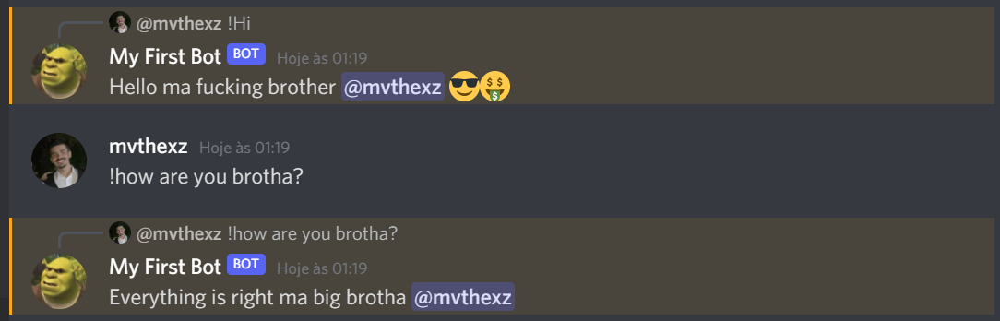

<h1 align="center">My First Bot</h1>

## Getting Started

    # Download dependencies 
    $ npm install
    # Starting application
    $ node index.js

## About

I was really curious about bot on discord, then I decided to try and following the documentation. So, you will find a two simple commands that shows a message in your discord server.

---

## Technologies 

- [Node.js](https://nodejs.org/en/)
- [Discord](https://discord.com/)

## Contact 

If you want to talk with me, please send me a message on [Twitter](https://twitter.com/matheus__tanaka).

